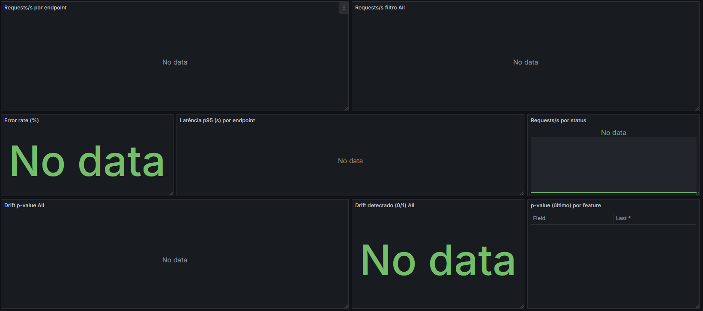
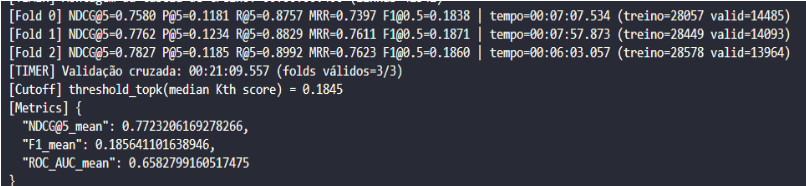
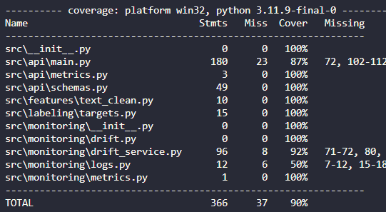
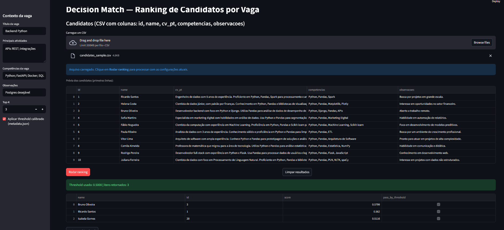

# 🚀 Decision Match — Pipeline, API, UI & Observability

Sistema de **matching candidato ↔ vaga** com pipeline de ML, **API em FastAPI**, **UI em Streamlit** e **observabilidade** (Prometheus + Grafana + Drift/Evidently). Projeto pronto para desenvolvimento local (Windows 11) e para execução via **Docker Compose**.


---

## 🗺️ Arquitetura

- **Pipeline de ML** (TF‑IDF + modelo linear scikit‑learn) → artefatos versionados em `models/artifacts/`.
- **API (FastAPI)** expõe `POST /score`, `POST /rank-candidates`, métricas Prometheus em `/metrics` e health em `/health`.
- **UI (Streamlit)** para testar a API com inputs reais.
- **Drift Service** (FastAPI + Evidently): lê `monitoring/requests_log.csv`, compara com `models/artifacts/baseline_features.csv` e publica:
  - Métricas em `/metrics` (Prometheus).
  - Relatórios HTML em `monitoring/drift_reports/`.
- **Prometheus** coleta métricas de `api:8000` e `drift:8001`.
- **Grafana** oferece dashboards provisionados por código (datasource + painel “Decision Match — Observability”).

📸 **Espaço para imagem do monitoramento (Grafana/Drift):**    


---

## 📂 Estrutura do repositório

```
├─ docker/                  # Dockerfiles (api, ui, drift)
├─ monitoring/
│  ├─ grafana/
│  │  ├─ provisioning/
│  │  │  ├─ datasources/datasource.yml
│  │  │  └─ dashboards/dashboards.yml + dm_observability.json
│  │  └─ ... (dados persistidos do Grafana)
│  ├─ prometheus.yml        # Targets api/drift
│  ├─ drift_reports/        # Relatórios Evidently (gerados em runtime)
│  └─ requests_log.csv      # Log de tráfego (gerado pela API)
├─ models/
│  └─ artifacts/            # Artefatos do modelo (baseline, vetores, etc.)
├─ scripts/                 # *.bat para Windows (setup, test, serve, train, docker)
├─ src/
│  ├─ api/                  # FastAPI (main, schemas)
│  ├─ features/             # Limpeza/feature engineering
│  ├─ labeling/             # Mapeamento de targets
│  ├─ monitoring/           # drift_service (Evidently)
│  └─ ...                   # utils, pipeline, treino, etc.
├─ ui/                      # Streamlit app
├─ tests/                   # unit + integration (pytest)
├─ docker-compose.yml
├─ pyproject.toml | requirements.txt
└─ README.md
```

> ℹ️ As pastas `monitoring/` e `models/artifacts/` são montadas como volumes pelo Docker Compose.

---

## ✅ Pré‑requisitos

- **Windows 11** + **Docker Desktop** (WSL2) + **Git** + **VS Code**.
- Python **3.11** (opcional para rodar local sem Docker).

---

## 💻 Instalação e desenvolvimento local (Windows 11 + VS Code)

```bat
:: 1) criar ambiente e instalar deps
scripts\setup_venv.bat

:: 2) (opcional) ativar venv manualmente
call .venv\Scripts\activate
```

---

## 🧠 Treino do modelo

Gera artefatos em `models/artifacts/` e **baseline** para drift (`baseline_features.csv`).

```bat
scripts\train.bat
```



### Visão geral
- **Base consolidada para treino:** 42.542 pares vaga↔candidato (14.081 vagas únicas).
- **Validação:** 3 folds com separação por vaga (garante que uma vaga não aparece ao mesmo tempo em treino e validação).
- **Tempo total de CV:** ~21 min (folds de ~6–8 min).

### Métricas principais (médias na validação)

#### NDCG@5 = 0,772
- **O que é:** mede a qualidade da ordem do ranking nos 5 primeiros (1,0 seria ordem perfeita).
- **Interpretação:** o modelo coloca os candidatos relevantes bem no topo. Para uso prático, significa que os primeiros resultados já são, na maioria, os mais úteis.

#### F1_mean (threshold 0,5) = 0,186
- **O que é:** média harmônica de precisão e recall depois de transformar o score em “aprovado/reprovado” usando corte 0,5.
- **Interpretação:** como nosso objetivo é ranquear, não classificar duro, o F1 aqui é secundário. Em bases desbalanceadas (poucos “positivos”), o F1 com corte fixo tende a ser baixo — isso é esperado e não contradiz um bom ranking.

#### ROC_AUC_mean = 0,658
- **O que é:** probabilidade do modelo dar score maior a um candidato relevante do que a um não relevante (0,5 = aleatório; 1,0 = perfeito).
- **Interpretação:** o modelo está acima do aleatório com margem razoável, mas ainda com espaço para evoluir. Mesmo assim, combinado com NDCG alto, já entrega boa utilidade prática para priorização.

### Métricas de apoio (por fold)
- **Precision@5 ≈ 0,118** → em média, ~0,6 candidato relevante nos 5 primeiros (0,118 × 5).
- **Recall@5 ≈ 0,88–0,90** → os 5 primeiros capturam ~88–90% dos relevantes de cada vaga.
- **MRR ≈ 0,75** → o primeiro relevante costuma aparecer na posição ~1,3 (quase sempre entre 1º e 2º do ranking).
- **Tradução para operação:** o recrutador tende a encontrar um candidato “bom” logo no topo, e dificilmente precisará descer além do Top-5 para ver o que importa.

### Cutoff de produção
- **threshold_topk (mediana do 5º score por vaga) = 0,1845.**
- **Para que serve:** usado pela API quando “Aplicar threshold” está ligado. Ajuda a controlar o tamanho da lista devolvida por vaga mantendo foco em qualidade.
- **Ajuste fino:** se quiser “ver mais nomes”, reduza o threshold; se quiser “ver só o creme do creme”, aumente. (Também dá para mudar o K.)

### Conclusão
- O modelo já está útil para priorização: coloca relevantes no topo (NDCG alto, MRR alto) e o Top-5 captura a grande maioria dos casos importantes (Recall@5 alto).
- O AUC indica uma distinção global consistente entre perfis bons e ruins, ainda com espaço para ganhos incrementais (mais sinais/engenharia de atributos, calibração de scores, etc.).
- O threshold calibrado deixa a API pronta para operar com listas objetivas, ajustáveis à necessidade do time (mais curtas ou mais amplas).

---

## 🧪 Testes & Cobertura



### O que a tabela mostra
- **Stmts**: total de linhas executáveis detectadas pelo `coverage.py`.
- **Miss**: linhas **não** exercitadas pelos testes.
- **Cover**: porcentagem de cobertura por arquivo.
- **Missing**: linhas (ou faixas) específicas que ficaram sem execução.

### Leitura dos números (snapshot atual)
- **Cobertura total**: **90%** (366 linhas, 37 faltantes) ✅
- **Destaques positivos**:
  - `src/api/schemas.py`, `src/features/text_clean.py`, `src/labeling/targets.py` e `src/api/metrics.py` com **100%**.
  - `src/monitoring/drift_service.py` avançou para **92%** — bom sinal de estabilidade no monitoramento e no fluxo do Evidently.
- **A melhorar**:
  - `src/api/main.py` → **87%** (linhas faltantes: `72, 102–112, 118, 124–125, 135–137, 171–173, 226–227, 346–348`).  
  - `src/monitoring/logs.py` → **50%** (linhas faltantes: `7–12, 15–18`).  


### 90% de cobertura!
- **Confiança em produção**: reduz risco de regressões silenciosas, especialmente em endpoints críticos e no pipeline de monitoramento.
- **Facilidade de evolução**: refactors ficam mais seguros e rápidos, já que os testes “seguram” contratos.
- **Qualidade contínua**: 90% como **quality gate** no CI ajuda a manter o padrão de entrega ao longo do tempo.

---

## ▶️ Subir a API e a UI localmente

```bat
:: API (FastAPI)
scripts\serve.bat
:: abre: http://localhost:8000/docs  e  http://localhost:8000/health

:: UI (Streamlit) — se houver script específico, usar:
:: streamlit run ui/app.py --server.port=8501 --server.address=0.0.0.0
```

📸 **Upload da base de vagas Streamlit):**  



---

## 🐳 Docker: build e subida dos serviços

Build das imagens e subida dos containers (API, UI, Drift, Prometheus, Grafana):

```bat
docker compose build
docker compose up -d
docker compose ps
```

> Para subir serviços isolados: `docker compose up -d api ui`, etc.  
> Para derrubar tudo: `docker compose down`.

**Rede**: `dm_net` conecta todos os serviços.  
**Volumes**:
- `./models/artifacts:/app/models/artifacts:ro`
- `./monitoring:/monitoring`

---

## 🌐 URLs e endpoints

**UI (Streamlit):**  
- `http://localhost:8501` — interface para interagir com a API.

**API (FastAPI):**  
- `http://localhost:8000` — raiz  
- `http://localhost:8000/health` — healthcheck (modelo, threshold, etc.)  
- `http://localhost:8000/docs` — Swagger UI  
- `http://localhost:8000/metrics` — métricas Prometheus  
- `POST http://localhost:8000/score` — score de um candidato  
- `POST http://localhost:8000/score-batch` — score em lote  
- `POST http://localhost:8000/rank-candidates` — ranking

**Drift Service:**  
- `http://localhost:8001/health` — status (baseline/log)  
- `http://localhost:8001/metrics` — métricas Prometheus (p-value, flag)  
- Relatórios Evidently: `monitoring/drift_reports/` (gerados em runtime)

**Prometheus:**  
- `http://localhost:9090` — console  
- `http://localhost:9090/targets` — alvos de scrape (api/drift)

**Grafana:**  
- `http://localhost:3000` — dashboards (login **admin/admin**)  
- Dashboard provisionado: **Decision Match — Observability** (pasta *Decision Match*)

---

## 📈 Observabilidade e Drift

- A **API** expõe contadores/histogramas: **requests total por endpoint/status** e **latência** (*histogram buckets*).
- O **Drift Service** roda a cada **60s**:
  1. Carrega baseline (`models/artifacts/baseline_features.csv`).
  2. Lê `monitoring/requests_log.csv` gerado pelas rotas da API.
  3. Executa Evidently (**DataDriftPreset**), exporta:
     - **Métricas**: `dm_drift_p_value{feature}`, `dm_drift_detected{feature}`.
     - **Relatório HTML**: `monitoring/drift_reports/drift_<timestamp>.html`.

---

## ⚙️ Provisionamento automático do Grafana (as‑code)

Arquivos em `monitoring/grafana/provisioning/`:

- **Datasource**: Prometheus (`url: http://prometheus:9090`, `uid: PROM`).  
- **Dashboards**: provider aponta para `/etc/grafana/provisioning/dashboards` e carrega `dm_observability.json`.

Reaplicar rapidamente:
```bat
docker compose restart grafana
docker compose logs -f grafana
```

---

## 🔧 Variáveis de ambiente

| Nome                | Serviço | Default | Descrição |
|---------------------|--------:|:------:|-----------|
| `THRESHOLD_TOPK`    | API     | `0.5`  | Limite mínimo de score para considerar um candidato |
| `TARGET_K`          | API     | `5`    | Top‑K retornado pelo ranking |
| `MONITORING_DIR`    | API/Drift | `/monitoring` | Pasta compartilhada para logs/relatórios |
| `DRIFT_REPORTS_DIR` | Drift   | (opcional) | Se definido, sobrescreve o diretório de relatórios (padrão `MONITORING_DIR/drift_reports`) |

---

## 🩹 Troubleshooting (Windows/Docker/Grafana)

- **Docker API/Context (Windows):**
  ```powershell
  docker context ls
  docker context use desktop-linux
  ```
- **`drift` reiniciando com `Read-only file system`:** grave relatórios em `/monitoring/drift_reports` (não em `/app/models/artifacts`).  
- **Prometheus `no such host drift`:** todos os serviços na rede `dm_net` + `docker compose up -d`.  
- **Grafana não carrega dashboard JSON:** salve **sem BOM** (UTF‑8). Reinicie o Grafana.  
- **Dashboards “No data”:** selecione **All** nas variáveis, ajuste o time range (ex.: *Last 1 hour*) e gere tráfego.

---

## 🎯 Boas práticas e próximos passos

- **SLOs**: defina metas (ex.: *p95 ≤ 1s*, *error rate < 1%*) e **alertas** no Grafana (p95, erro, drift).  
- **Dados/Privacidade**: evite logar PII; use proxies de métricas (comprimentos, scores).  
- **MLOps**: versionar artefatos, automatizar re‑treino quando drift for detectado.  
- **CI/CD**: pipelines com lint, testes, build de imagens e deploy versionado.

---

## 📄 Licença

Projeto acadêmico/educacional.